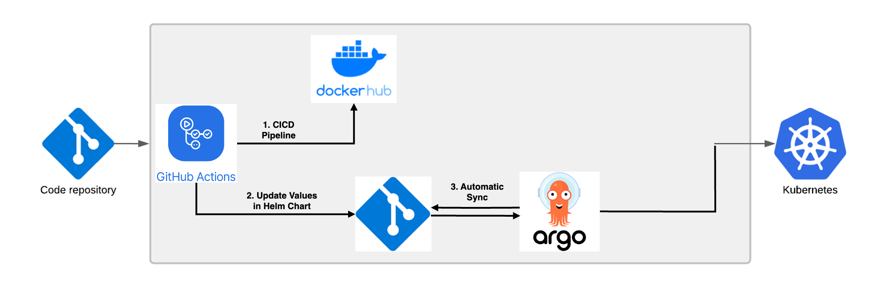

# EKS TOY FASTAPI

## 개요
  - helm으로 구성한 kubernetes를 EKS에 배포 연습 
### 조건
  - RESTful API Server 를 Contaierize 하여 Helm을 이용한 Kubernetes에 배포
  - 해당 Server 는 `/hellosocar` Endpoint를 가집니다.
### 사용 도구
  - Python
  - FastAPI
  - NGINX Ingress
  - Argo CD
  - GitHub Action
  - Terraform

### 아키텍처

